<!--
  This profile is a printout. Every sheet below is generated by src/build.py
  and reprinted daily by .github/workflows/print.yml. See DESIGN.md.
-->

↳ <a href="https://github.com/tahcin/luck-serendipity-summaries">the reading board</a>

↳ <a href="https://github.com/tahcin/parchi">tahcin/parchi</a>

↳ <a href="https://deadline-dash.vercel.app">live</a> · <a href="https://github.com/tahcin/deadline-dash">source</a>

↳ <a href="https://pet-island.vercel.app">play</a> · <a href="https://github.com/tahcin/pet-island">source</a>

↳ <a href="https://gradestone.in">gradestone.in</a> · <a href="https://github.com/tahcin/iimbx-transcript-downloader">transcripts</a> · <a href="https://github.com/tahcin/luck-serendipity-summaries">reading board</a> · <a href="https://github.com/tahcin/truesports">truesports</a> · <a href="https://github.com/tahcin/image-kit">image-kit</a>

<a href="https://tahcin.gradestone.in">résumé</a> · <a href="https://gradestone.in">gradestone</a> · <a href="DESIGN.md">how this printout is made</a>

